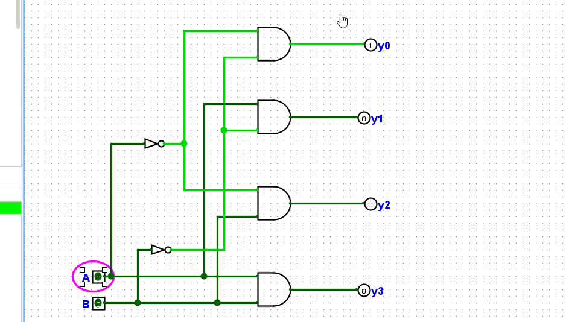

# 2-to-4 Binary Decoder

### 1. Function
A 2-to-4 decoder takes a 2-bit binary input (A, B) and activates exactly one of 4 output lines (Y0–Y3).

$$Y_i = 1 \quad \text{when} \quad (A, B) = i$$

### 2. Truth Table

| A | B | Y0 | Y1 | Y2 | Y3 |
|---|---|----|----|----|----|
| 0 | 0 | 1  | 0  | 0  | 0  |
| 0 | 1 | 0  | 1  | 0  | 0  |
| 1 | 0 | 0  | 0  | 1  | 0  |
| 1 | 1 | 0  | 0  | 0  | 1  |

### 3. Design
Built in Logisim-Evolution using a **modular subcircuit** approach:
- `Decoder_subcircuit` — reusable 2-to-4 decoder block
- `main` — top-level circuit instantiating the decoder

### 4. Simulation Verification

### 5. Subcircuit Demo

