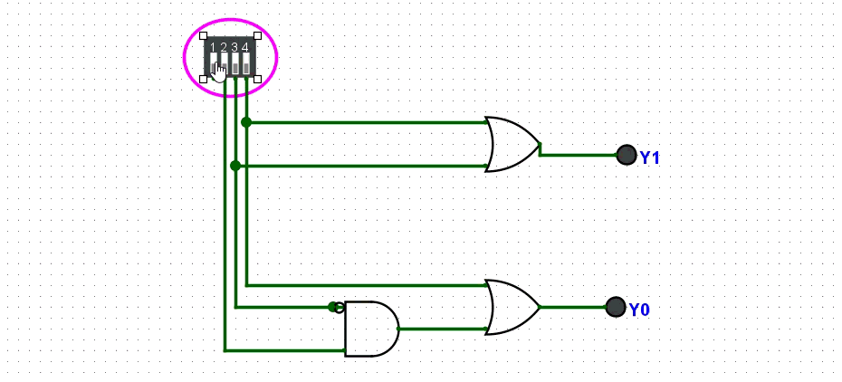

# 4-to-2 Binary Encoder

### 1. Function
A 4-to-2 encoder converts 4 input lines (D0–D3) into a 2-bit binary code (Y1, Y0). Exactly one input is assumed active at a time.

$$Y_1 = D_2 + D_3 \qquad Y_0 = D_1 + D_3$$

### 2. Truth Table

| D3 | D2 | D1 | D0 | Y1 | Y0 |
|----|----|----|----|----|-----|
| 0  | 0  | 0  | 1  | 0  | 0   |
| 0  | 0  | 1  | 0  | 0  | 1   |
| 0  | 1  | 0  | 0  | 1  | 0   |
| 1  | 0  | 0  | 0  | 1  | 1   |

### 3. Design
Built in Logisim-Evolution using OR gates with a **DipSwitch** input and **7-Segment Display** output (`Encoder.circ`).

### 4. Simulation

---

# 4-to-2 Priority Encoder

### 1. Function
A priority encoder handles the case where multiple inputs may be active simultaneously. It outputs the binary code of the **highest-priority** (highest-numbered) active input.

$$Y_1 = A_3 + A_2 \qquad Y_0 = A_3 + \overline{A_2} \cdot A_1$$

### 2. Truth Table

| A3 | A2 | A1 | A0 | Y1 | Y0 |
|----|----|----|----|----|-----|
| 0  | 0  | 0  | 1  | 0  | 0   |
| 0  | 0  | 1  | ×  | 0  | 1   |
| 0  | 1  | ×  | ×  | 1  | 0   |
| 1  | ×  | ×  | ×  | 1  | 1   |

### 3. Design
Built in Logisim-Evolution using a **modular subcircuit** approach (`PriorityEncoder.circ`):
- `PE` — reusable 4-to-2 priority encoder block (OR + AND gates)
- `main` — top-level circuit instantiating multiple PE blocks with a Hex Digit Display

### 4. Simulation

