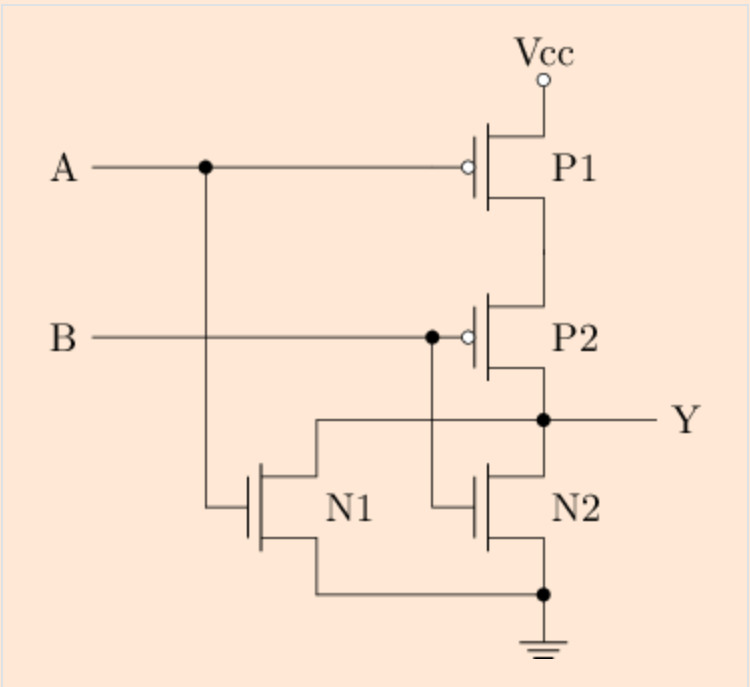
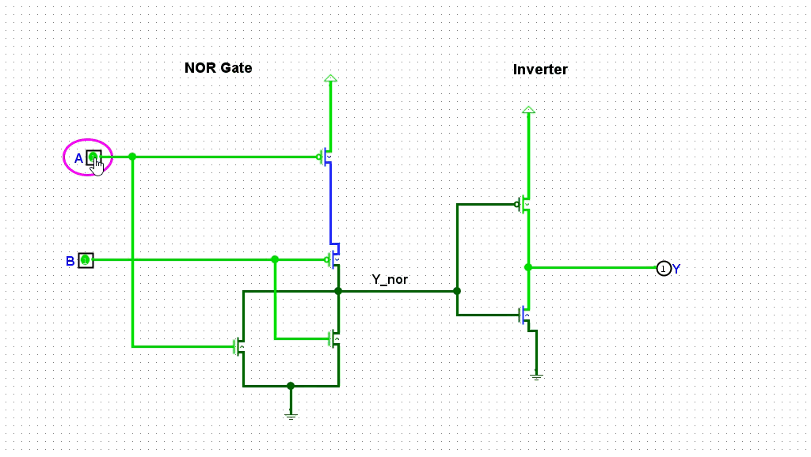

OR Gate — Transistor-Level Implementation

### 1. Gate Equation
$$Y = A + B$$

### 2. Transistor-Level Design
Implemented at the transistor level using PMOS and NMOS in Logisim-Evolution.

* **PMOS Network (Pull-up):** 2 PMOS in series
* **NMOS Network (Pull-down):** 2 NMOS in parallel
* **Total:** 4 Transistors (2 PMOS + 2 NMOS) + 1 inverter (2T) = **6 Transistors**

### 3. Analysis

### 4. Simulation Verification

