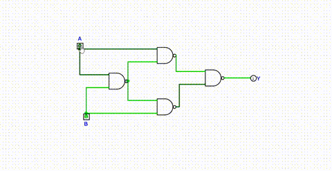

XOR Gate Implementation

### 1. Original Equation
$$Y = \overline{\overline{A(\overline{AB})} \cdot \overline{B(\overline{AB})}}$$

### 2. Optimized NAND Equation
`Y = [ A · (A·B)' ]' · [ B · (A·B)' ]'`

### 3. Transistor Calculation (Static CMOS)
* **2-Input NAND Gate:** 4 Transistors (2 PMOS + 2 NMOS)
* **Total Calculation:** 4 NAND gates × 4 transistors = **16 Transistors**

### 4. Simulation Verification
